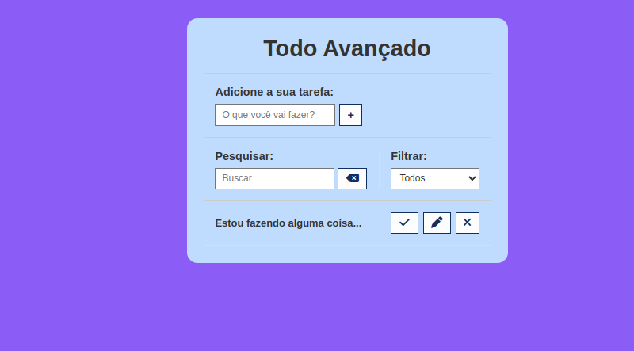

<h1 align="center"> Todo Avançado </h1>

 

<h3 align="center">Tela inicial</h3>

 
  

## 🚀 Tecnologias

Esse projeto foi desenvolvido com as seguintes tecnologias:

- HTML e CSS
- JavaScript

 
<h3 align="center">Adicionando tarefa </h3>

 
  

 

 
<h3 align="center">Tarefa Finalizada </h3>

 
  

 

 
<h3 align="center">Editando a tarefa </h3>

 
  

 
## 💻 Projeto

O projeto foi desenvolvido para realizar práticas das tecnologias utilizadas. Também é possível excluir a atividade descrita na lista.